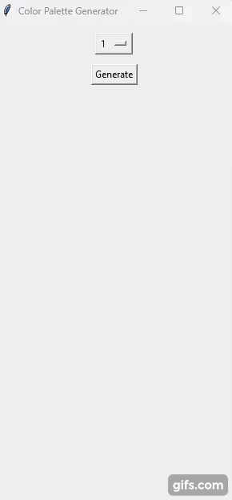

# Simple Color Palette Generator

Simple Color Palette Generator

App was made following [this](https://www.youtube.com/watch?v=ujfsn6u-1QU&ab_channel=AlinaChudnova) tutorial made by youtuber Alina Chudnova.

### Features

- Select 'n' amount of colors in palette
- Generate n random colors

## Demo

## Requirements
- Python 3+
- ttkbootstrap

## Usage

1. Run 'python main.py'